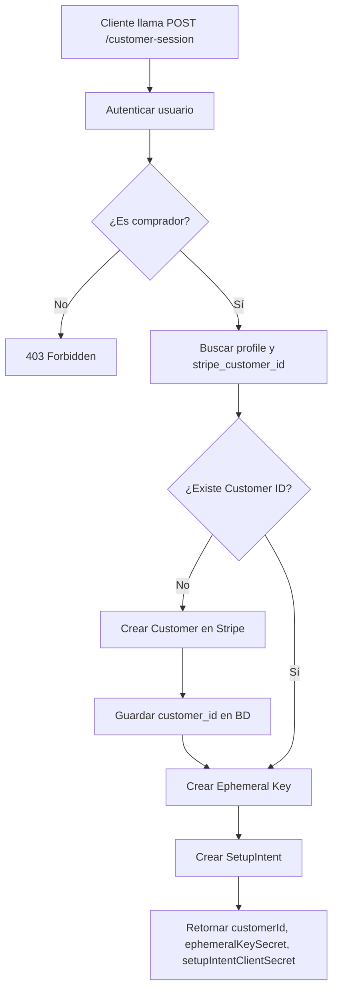
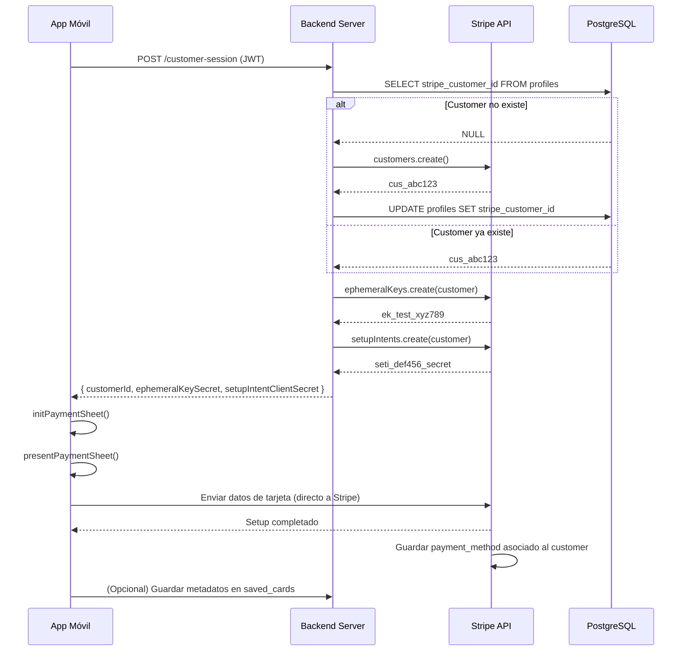

# Implementación: Endpoint de Customer Session para Stripe

## 📋 Resumen

Se ha implementado un endpoint **seguro del lado del servidor** para manejar la creación de Customer Sessions en Stripe, necesario para guardar tarjetas de crédito de forma segura para pagos futuros.

---

## 🎯 Objetivo

Permitir que los compradores guarden sus tarjetas de crédito de forma segura usando **Stripe Payment Element**, sin exponer claves secretas en el cliente móvil.

---

## 🔧 Cambios Implementados

### 1. ✅ Base de Datos: Agregar `stripe_customer_id` a profiles

**Archivo:** [Backend/db/schema.sql](Backend/db/schema.sql)

**Cambio:**
```sql
-- Asegurar columna ciudad exista si la tabla ya existía
ALTER TABLE profiles ADD COLUMN IF NOT EXISTS ciudad TEXT;
ALTER TABLE profiles ADD COLUMN IF NOT EXISTS total_pedidos INTEGER DEFAULT 0;
ALTER TABLE profiles ADD COLUMN IF NOT EXISTS total_ahorrado DECIMAL(10,2) DEFAULT 0.00;
ALTER TABLE profiles ADD COLUMN IF NOT EXISTS co2_ahorrado DECIMAL(10,2) DEFAULT 0.00;
ALTER TABLE profiles ADD COLUMN IF NOT EXISTS stripe_customer_id VARCHAR(255);
```

**Descripción:**
- Agrega columna `stripe_customer_id` para almacenar el ID del Customer de Stripe
- Permite asociar cada comprador con su Customer en Stripe
- Solo se crea cuando el usuario intenta guardar su primera tarjeta

**Aplicar migración:**
```bash
cd /workspaces/Delicrunch/Backend
psql -U postgres -d delicrunch -f db/schema.sql
```

O desde Node.js:
```bash
node -e "const pool = require('./db'); pool.query('ALTER TABLE profiles ADD COLUMN IF NOT EXISTS stripe_customer_id VARCHAR(255)').then(() => { console.log('✅ Columna agregada'); process.exit(); });"
```

---

### 2. ✅ Controlador: Nuevo endpoint `createCustomerSession`

**Archivo:** [Backend/controllers/paymentController.js](Backend/controllers/paymentController.js)

**Endpoint:** `POST /api/payments/customer-session`

**Código:**
```javascript
/**
 * @desc    Crear Customer Session para guardar tarjetas (Ephemeral Key + SetupIntent)
 * @route   POST /api/payments/customer-session
 * @access  Privado (Comprador)
 */
exports.createCustomerSession = asyncHandler(async (req, res, next) => {
    const userId = req.user.id;
    const userEmail = req.user.email;

    // 1. Validar que el usuario sea comprador
    if (req.user.rol !== 'comprador') {
        return res.status(403).json({ 
            msg: 'Acción no autorizada. Solo compradores pueden guardar tarjetas.' 
        });
    }

    // 2. Buscar el perfil del comprador y su stripe_customer_id
    const profileResult = await pool.query(
        'SELECT id, stripe_customer_id FROM profiles WHERE user_id = $1',
        [userId]
    );

    if (profileResult.rows.length === 0) {
        return res.status(404).json({ 
            msg: 'Perfil de comprador no encontrado.' 
        });
    }

    let { stripe_customer_id: stripeCustomerId } = profileResult.rows[0];
    const profileId = profileResult.rows[0].id;

    // 3. Si no existe stripe_customer_id, crear un Customer en Stripe
    if (!stripeCustomerId) {
        const customer = await stripe.customers.create({
            email: userEmail,
            metadata: {
                user_id: userId.toString(),
                profile_id: profileId.toString(),
                platform: 'delicrunch',
            },
        });
        
        stripeCustomerId = customer.id;

        // Guardar el customer_id en la base de datos
        await pool.query(
            'UPDATE profiles SET stripe_customer_id = $1 WHERE id = $2',
            [stripeCustomerId, profileId]
        );
    }

    // 4. Crear Ephemeral Key para el Customer
    const ephemeralKey = await stripe.ephemeralKeys.create(
        { customer: stripeCustomerId },
        { apiVersion: '2024-12-18.acacia' } // Versión fija
    );

    // 5. Crear SetupIntent para guardar método de pago
    const setupIntent = await stripe.setupIntents.create({
        customer: stripeCustomerId,
        payment_method_types: ['card'],
        usage: 'off_session', // Para pagos futuros
        metadata: {
            user_id: userId.toString(),
            purpose: 'save_card_for_future_payments',
        },
    });

    // 6. Retornar los datos necesarios al cliente
    res.json({
        customerId: stripeCustomerId,
        ephemeralKeySecret: ephemeralKey.secret,
        setupIntentClientSecret: setupIntent.client_secret,
        publishableKey: process.env.STRIPE_PUBLISHABLE_KEY,
    });
});
```

**Flujo del endpoint:**



---

### 3. ✅ Rutas: Registrar el nuevo endpoint

**Archivo:** [Backend/routes/paymentRoutes.js](Backend/routes/paymentRoutes.js)

**Cambio:**
```javascript
const { 
    createCustomerSession, // ← NUEVO
    createPaymentIntent, 
    createAccountLink,
    // ... otros
} = require('../controllers/paymentController');

// @route   POST /api/payments/customer-session
// @desc    Crea Customer, Ephemeral Key y SetupIntent para guardar tarjetas
// @access  Privado (Comprador)
router.post('/customer-session', authMiddleware, createCustomerSession);
```

---

## 🔐 Seguridad y Validaciones

### Validaciones Implementadas

1. **Autenticación obligatoria:**
   - Usa `authMiddleware` para verificar JWT
   - Solo usuarios autenticados pueden llamar al endpoint

2. **Autorización por rol:**
   ```javascript
   if (req.user.rol !== 'comprador') {
       return res.status(403).json({ msg: 'Solo compradores...' });
   }
   ```

3. **Existencia de perfil:**
   - Verifica que el usuario tenga un registro en `profiles`
   - Retorna 404 si no existe

4. **Manejo de errores:**
   - Usa `asyncHandler` para capturar excepciones
   - Try-catch específicos para operaciones de Stripe
   - Logs detallados con `console.log/error`

5. **Idempotencia:**
   - Si `stripe_customer_id` ya existe, lo reutiliza
   - No crea múltiples Customers para el mismo usuario

---

## 🌍 Variables de Entorno Requeridas

**Archivo:** [Backend/.env](Backend/.env)

```dotenv
# Stripe API Keys
STRIPE_SECRET_KEY=sk_test_51SRRXZ4wPhwNrw0SdDWDxizLqHWwMv3VtK3dejGrNnzSU0wf99lAbfclFjyNL5H40jh3lhtrPJ26ISpyUzduoJfJ00IHHrCQz1
STRIPE_PUBLISHABLE_KEY=pk_test_51SRRXZ4wPhwNrw0SqyvpM04EQdcUoc0Xsi8R7UJLb95v7YC4jtRVQXf3X5BhIPkNWs5B0wekylV2TRA6h2pveA2200DXKDKUph
```

**✅ Ya están configuradas correctamente**

---

## 📱 Uso desde el Cliente (React Native)

### Paso 1: Llamar al endpoint desde el frontend

```javascript
// Frontend/services/paymentService.js
import AsyncStorage from '@react-native-async-storage/async-storage';
import Constants from 'expo-constants';

const API_URL = Constants.expoConfig?.extra?.apiUrl || 'http://localhost:5001';

export const createCustomerSession = async () => {
    try {
        const token = await AsyncStorage.getItem('token');
        
        if (!token) {
            throw new Error('No hay sesión activa');
        }

        const response = await fetch(`${API_URL}/api/payments/customer-session`, {
            method: 'POST',
            headers: {
                'Content-Type': 'application/json',
                'Authorization': `Bearer ${token}`,
            },
        });

        if (!response.ok) {
            const error = await response.json();
            throw new Error(error.msg || 'Error al crear sesión de Stripe');
        }

        const data = await response.json();
        // data = { customerId, ephemeralKeySecret, setupIntentClientSecret, publishableKey }
        
        return data;
    } catch (error) {
        console.error('❌ Error en createCustomerSession:', error);
        throw error;
    }
};
```

### Paso 2: Inicializar Payment Sheet con los datos

```javascript
// Frontend/app/SaveCardScreen.js
import { useStripe } from '@stripe/stripe-react-native';
import { createCustomerSession } from '../services/paymentService';

const SaveCardScreen = () => {
    const { initPaymentSheet, presentPaymentSheet } = useStripe();
    const [loading, setLoading] = useState(false);

    const setupPaymentSheet = async () => {
        try {
            setLoading(true);

            // 1. Obtener datos del servidor
            const { customerId, ephemeralKeySecret, setupIntentClientSecret } = 
                await createCustomerSession();

            // 2. Inicializar Payment Sheet
            const { error } = await initPaymentSheet({
                merchantDisplayName: 'Delicrunch',
                customerId: customerId,
                customerEphemeralKeySecret: ephemeralKeySecret,
                setupIntentClientSecret: setupIntentClientSecret,
                allowsDelayedPaymentMethods: true,
                returnURL: 'delicrunch://payment-result',
            });

            if (error) {
                console.error('Error al inicializar Payment Sheet:', error);
                Alert.alert('Error', error.message);
                return;
            }

            // 3. Presentar el formulario de tarjeta
            const { error: presentError } = await presentPaymentSheet();

            if (presentError) {
                if (presentError.code !== 'Canceled') {
                    Alert.alert('Error', presentError.message);
                }
            } else {
                Alert.alert('¡Éxito!', 'Tarjeta guardada correctamente');
                // Navegar de regreso o actualizar lista de tarjetas
            }

        } catch (error) {
            console.error('Error:', error);
            Alert.alert('Error', error.message);
        } finally {
            setLoading(false);
        }
    };

    return (
        <View style={styles.container}>
            <Button 
                title={loading ? 'Cargando...' : 'Agregar Tarjeta'}
                onPress={setupPaymentSheet}
                disabled={loading}
            />
        </View>
    );
};
```

---

## 🧪 Pruebas y Validación

### 1. Probar el endpoint con curl

```bash
# 1. Obtener token de autenticación (login como comprador)
TOKEN=$(curl -X POST http://localhost:5001/api/auth/login \
  -H "Content-Type: application/json" \
  -d '{"email":"comprador@test.com","password":"password123"}' \
  | jq -r '.token')

# 2. Llamar al endpoint customer-session
curl -X POST http://localhost:5001/api/payments/customer-session \
  -H "Content-Type: application/json" \
  -H "Authorization: Bearer $TOKEN" \
  | jq
```

**Respuesta esperada:**
```json
{
  "customerId": "cus_RbC1234567890",
  "ephemeralKeySecret": "ek_test_YWNjdF8xU1JSWFo0d1Bod05ydzBTLF...",
  "setupIntentClientSecret": "seti_1RbC1234567890_secret_abc123...",
  "publishableKey": "pk_test_51SRRXZ4wPhwNrw0S..."
}
```

### 2. Verificar en el dashboard de Stripe

1. Ir a [Stripe Dashboard - Customers](https://dashboard.stripe.com/test/customers)
2. Buscar el customer creado con el email del comprador
3. Verificar que los metadatos incluyan `user_id`, `profile_id`, `platform`

### 3. Verificar en la base de datos

```sql
-- Ver compradores con stripe_customer_id
SELECT 
    u.id, 
    u.email, 
    u.nombre,
    p.stripe_customer_id 
FROM users u
JOIN profiles p ON u.id = p.user_id
WHERE u.rol = 'comprador';
```

---

## 🔍 Troubleshooting

### Error: "Acción no autorizada. Solo compradores..."

**Causa:** El usuario autenticado no tiene rol `comprador`

**Solución:**
```sql
-- Verificar el rol del usuario
SELECT id, email, rol FROM users WHERE email = 'tu-email@test.com';

-- Si es necesario, cambiar el rol
UPDATE users SET rol = 'comprador' WHERE email = 'tu-email@test.com';
```

---

### Error: "Perfil de comprador no encontrado"

**Causa:** El usuario no tiene un registro en la tabla `profiles`

**Solución:**
```sql
-- Crear un perfil para el usuario
INSERT INTO profiles (user_id, ciudad) 
VALUES (
    (SELECT id FROM users WHERE email = 'tu-email@test.com'),
    'Ciudad de México'
);
```

---

### Error: "Error al crear Stripe Customer"

**Causa:** Clave de API inválida o problema de conexión con Stripe

**Verificar:**
```bash
# 1. Verificar variables de entorno
cat Backend/.env | grep STRIPE

# 2. Probar la clave directamente con Stripe CLI
stripe customers list --api-key sk_test_51SRRXZ...
```

---

### Error: "Invalid API version"

**Causa:** Versión de la API incorrecta al crear Ephemeral Key

**Solución:** Usar la versión actual de tu cuenta Stripe
```javascript
// En paymentController.js
const ephemeralKey = await stripe.ephemeralKeys.create(
    { customer: stripeCustomerId },
    { apiVersion: '2024-12-18.acacia' } // ← Actualizar si es necesario
);
```

**Obtener tu versión:**
1. Ir a [Stripe Dashboard - Developers](https://dashboard.stripe.com/test/developers)
2. Copiar "API version" (ejemplo: `2024-12-18.acacia`)

---

## 📊 Flujo Completo: Guardar Tarjeta



---

## 📝 Diferencias Clave vs Implementación Anterior

| Aspecto | ❌ Antes (Inseguro) | ✅ Ahora (Seguro) |
|---------|---------------------|-------------------|
| **Ephemeral Keys** | Creadas en el cliente | Creadas en el servidor |
| **Customer Creation** | Cliente con publishable key | Servidor con secret key |
| **Secret Key** | Expuesta en frontend | Solo en backend |
| **SetupIntent** | Cliente crea el intent | Servidor crea el intent |
| **Seguridad** | Baja (keys expuestas) | Alta (keys en servidor) |
| **PCI Compliance** | ⚠️ Riesgoso | ✅ Cumple estándares |

---

## ✅ Checklist de Implementación

- [x] ✅ Agregar columna `stripe_customer_id` a tabla `profiles`
- [x] ✅ Crear endpoint `POST /api/payments/customer-session`
- [x] ✅ Validar rol de usuario (solo compradores)
- [x] ✅ Crear Customer en Stripe si no existe
- [x] ✅ Crear Ephemeral Key con API version fija
- [x] ✅ Crear SetupIntent para guardar tarjeta
- [x] ✅ Retornar datos necesarios al cliente
- [x] ✅ Manejo de errores y logging
- [x] ✅ Variables de entorno configuradas
- [ ] 🔄 Aplicar migración en BD (ejecutar SQL)
- [ ] 🔄 Probar endpoint con curl
- [ ] 🔄 Integrar en frontend con Payment Sheet
- [ ] 🔄 Validar en Stripe Dashboard

---

## 🚀 Próximos Pasos

1. **Aplicar migración:**
   ```bash
   cd /workspaces/Delicrunch/Backend
   psql -U postgres -d delicrunch -f db/schema.sql
   ```

2. **Reiniciar backend:**
   ```bash
   cd /workspaces/Delicrunch/Backend
   npm start
   ```

3. **Crear servicio en frontend:**
   - Agregar `createCustomerSession()` en `paymentService.js`

4. **Crear pantalla SaveCardScreen:**
   - Integrar Payment Sheet
   - Llamar al endpoint
   - Manejar respuesta

5. **Probar flujo completo:**
   - Login como comprador
   - Ir a "Agregar Tarjeta"
   - Ingresar tarjeta de prueba: `4242 4242 4242 4242`
   - Verificar en Stripe Dashboard

---

## 📚 Referencias

- [Stripe API - Customers](https://stripe.com/docs/api/customers)
- [Stripe API - Ephemeral Keys](https://stripe.com/docs/api/ephemeral_keys)
- [Stripe API - SetupIntents](https://stripe.com/docs/api/setup_intents)
- [Stripe React Native - Payment Sheet](https://stripe.com/docs/payments/accept-a-payment?platform=react-native&ui=payment-sheet)
- [Stripe Mobile - Security Best Practices](https://stripe.com/docs/security/mobile)

---

**Estado:** ✅ Implementación completa - Lista para pruebas  
**Endpoint:** `POST /api/payments/customer-session`  
**Autenticación:** JWT Token requerido  
**Rol:** Solo `comprador`
